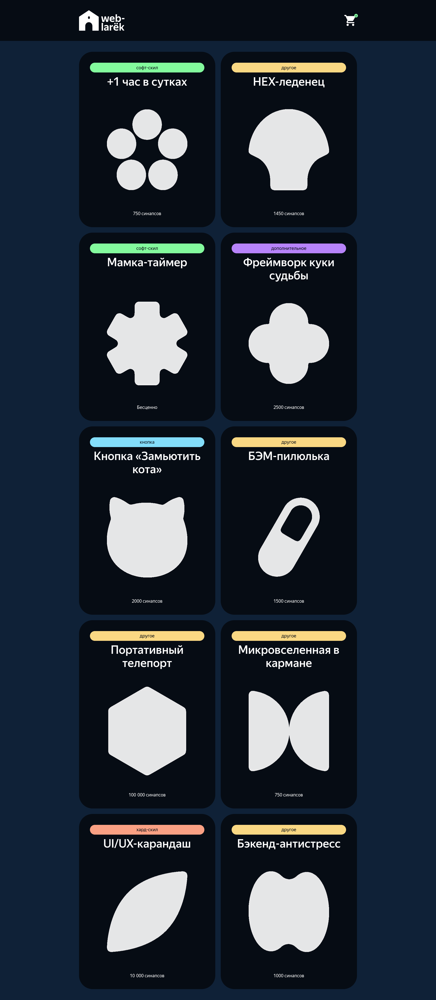

# Проектная работа "Веб-ларек"

## Оглавление

- [Запуск](#запуск)
- [Сборка](#сборка)
- [Описание](#описание)
- [Скриншоты](#скриншоты)
- [Документация](#документация)
- [Автор](#автор)
- [Благодарность](#благодарность)

## Запуск

Для установки и запуска проекта необходимо выполнить команды

```
npm install
npm run start
```

или

```
yarn
yarn start
```

## Сборка

```
npm run build
```

или

```
yarn build
```

## Описание

Онлайн магазин необходимых для веб разработчика мелочей.

Стек: HTML, SCSS, TS, Webpack

Структура проекта:

- src/ — исходные файлы проекта
- src/components/ — папка с JS компонентами
- src/components/base/ — папка с базовым кодом

Важные файлы:

- src/pages/index.html — HTML-файл главной страницы
- src/types/index.ts — файл с типами
- src/index.ts — точка входа приложения
- src/scss/styles.scss — корневой файл стилей
- src/utils/constants.ts — файл с константами
- src/utils/utils.ts — файл с утилитами

## Об архитектуре 

Основные части архитектуры проекта
Архитектура проекта состоит из следующих основных частей:

Данные – Модели и интерфейсы, которые описывают структуру данных, хранящихся в приложении, такие как товары, корзина, заказ, ошибки форм и т.д. Эти данные определяют состояние приложения и его логику.

Отображения – Компоненты, которые отвечают за визуальное отображение данных в интерфейсе. К ним относятся страницы, карточки товаров, корзина, формы и другие элементы, отображаемые на экране.

Экран (UI) – Представляет собой структуру страниц и интерфейсных элементов, таких как модальные окна, формы, кнопки, списки товаров и т.д.

Обработчики событий (Event Emitters) – Механизм взаимодействия компонентов через события. Например, событие добавления товара в корзину обновляет её состояние и отображает изменения на экране.

Зачем нужны эти части, какие функции они выполняют?
Модели данных хранят состояние приложения и обеспечивают методы для управления этими данными.

Отображения визуализируют данные и позволяют пользователю взаимодействовать с приложением (например, добавлять товары в корзину, оформлять заказ).

События синхронизируют взаимодействие между компонентами и данными, обеспечивая обновление состояния и интерфейса при действиях пользователя.

Как части взаимодействуют?
Компоненты отображения получают данные из моделей и визуализируют их. При изменении данных (например, добавление товара в корзину) модель инициирует событие, которое вызывает обновление соответствующих компонентов.
События управляют логикой взаимодействия между компонентами, как например: добавление в корзину, обновление заказа, валидация форм и т.д.

Данные, используемые в приложении
Данные представлены в виде интерфейсов, определяющих структуру объектов:

IProduct – карточка товара.
IAppState – текущее состояние приложения, включающее корзину, магазин, заказ, ошибки формы и методы для управления этим состоянием.
IOrder – детали заказа (способ оплаты, адрес доставки и т.д.).

Из каких компонентов состоит приложение?
Приложение состоит из следующих компонентов:

Page – основной компонент, представляющий страницу магазина.
Card – компонент, представляющий карточку товара.
Basket – компонент, представляющий корзину с товарами.
Order – компонент, представляющий форму заказа.
Contacts – компонент для ввода контактной информации.

Как реализованы процессы в приложении?
Процессы в приложении реализованы через механизм событий. Например:

Добавление товара в корзину инициирует событие card:toBasket, которое обновляет корзину и визуальные элементы на странице.
Удаление товара из корзины инициирует событие basket:delete, обновляющее корзину и визуализирующее изменения.

Описание классов

Class Component<T>
Описание: Базовый класс для всех компонентов приложения. Предоставляет методы для управления DOM-элементами (установка текста, скрытие/показ, изменение классов и т.д.).
Свойства и методы:

container: HTMLElement – родительский DOM-элемент для компонента.
toggleClass(element: HTMLElement, className: string, force?: boolean): void – переключает класс на элементе.
setText(element: HTMLElement, value: string): void – устанавливает текстовое содержимое элемента.
setHidden(element: HTMLElement): void – скрывает элемент.
setVisible(element: HTMLElement): void – показывает элемент.

Class Page extends Component<IPage>
Описание: Компонент, представляющий страницу магазина. Управляет списком товаров и корзиной. Свойства и методы:

_counter: HTMLElement – отображает количество товаров в корзине.
_store: HTMLElement – контейнер для карточек товаров.
_basket: HTMLElement – контейнер для корзины.
set counter(value: number) – обновляет количество товаров в корзине.
set store(items: HTMLElement[]) – обновляет список товаров на странице.
set locked(value: boolean) – блокирует прокрутку страницы.

Class Card extends Component<ICard>
Описание: Компонент, представляющий карточку товара. Отображает информацию о товаре, включая название, изображение, категорию и цену. Свойства и методы:

_title: HTMLElement – элемент для названия товара.
_image: HTMLImageElement – элемент для изображения товара.
_category: HTMLElement – элемент для категории товара.
_price: HTMLElement – элемент для отображения цены товара.
set id(value: string) – устанавливает уникальный ID товара.
set title(value: string) – устанавливает название товара.
set image(value: string) – устанавливает изображение товара.
set selected(value: boolean) – устанавливает статус выбора товара.
set price(value: number | null) – устанавливает цену товара.
set category(value: CategoryType) – устанавливает категорию товара.

Class Basket extends Component<IBasket>
Описание: Компонент, представляющий корзину товаров. Управляет отображением списка товаров в корзине и общей суммой заказа. Свойства и методы:

_list: HTMLElement – контейнер для списка товаров.
_price: HTMLElement – отображает общую сумму заказа.
_button: HTMLButtonElement – кнопка "Оформить".
set price(price: number) – устанавливает общую сумму заказа.
set list(items: HTMLElement[]) – обновляет список товаров в корзине.

Class Order extends Form<IOrder>
Описание: Компонент, представляющий форму заказа. Позволяет пользователю ввести данные для заказа, такие как адрес и способ оплаты. Свойства и методы:

_card: HTMLButtonElement – кнопка для выбора оплаты картой.
_cash: HTMLButtonElement – кнопка для выбора оплаты наличными.
disableButtons(): void – отключает кнопки выбора оплаты.

Class Contacts extends Form<IContacts>
Описание: Компонент для ввода контактной информации, такой как телефон и email. Свойства и методы:

phone: string – телефон покупателя.
email: string – электронная почта покупателя.

Class AppState extends Model<IAppState>
Описание: Главная модель, управляющая состоянием приложения. Содержит методы для управления корзиной, заказом и данными магазина. Свойства и методы:

basket: Product[] – массив товаров в корзине.
store: Product[] – массив товаров в магазине.
order: IOrder – объект заказа.
addToBasket(value: Product): void – добавляет товар в корзину.
deleteFromBasket(id: string): void – удаляет товар из корзины.
getBasketAmount(): number – возвращает количество товаров в корзине.
getTotalBasketPrice(): number – возвращает общую сумму товаров в корзине.

Class Api
Описание: Класс для взаимодействия с сервером. Выполняет HTTP-запросы для получения данных о товарах и отправки заказов. Свойства и методы:

get(uri: string) – отправляет GET-запрос.
post(uri: string, data: object) – отправляет POST-запрос.

Class EventEmitter
Описание: Класс для управления событиями в приложении. Позволяет подписываться на события, отключать подписки и инициировать события. Свойства и методы:

on(eventName: EventName, callback: (event: T) => void) – подписывается на событие.
off(eventName: EventName, callback: Subscriber) – отключает подписку.
emit(eventName: string, data?: T) – инициирует событие.

Описание данных и их типов:

IProduct – описывает данные о товаре, такие как ID, название, описание, цена и т.д.
IAppState – описывает состояние приложения: корзину, магазин, заказ и ошибки форм.
IOrder – описывает данные заказа: список товаров, способ оплаты, адрес и контактные данные.

## Скриншоты



## Документация

### Типы данных

```TypeScript
/*
    Тип описывающий все возможные категории товара
*/
type CategoryType =
  | 'другое'
  | 'софт-скил'
  | 'дополнительное'
  | 'кнопка'
  | 'хард-скил';

/*
    Тип, описывающий ошибки валидации форм
*/
type FormErrors = Partial<Record<keyof IOrderForm, string>>;

/*
  * Интерфейс, описывающий карточку товара в магазине
* */
interface IProduct {
  // уникальный ID
  id: string;

  // описание товара
  description: string;

  // ссылка на картинку
  image: string;

  // название
  title: string;

  // категория товара
  category: CategoryType;

  // цена товара, может быть null
  price: number | null;

  // был данный товар добавлен в корзину или нет
  selected: boolean;
}

/*
  * Интерфейс, описывающий внутренне состояние приложения
    Используется для хранения карточек, корзины, заказа пользователя, ошибок
    в формах
    Так же имеет методы для работы с карточками и корзиной
  * */
interface IAppState {
  // Корзина с товарами
  basket: Product[];

  // Массив карточек товара
  store: Product[];

  // Информация о заказе при покупке товара
  order: IOrder;

  // Ошибки при заполнении форм
  formErrors: FormErrors;

  // Метод для добавления товара в корзину
  addToBasket(value: Product): void;

  // Метод для удаления товара из корзины
  deleteFromBasket(id: string): void;

  // Метод для полной очистки корзины
  clearBasket(): void;

  // Метод для получения количества товаров в корзине
  getBasketAmount(): number;

  // Метод для получения суммы цены всех товаров в корзине
  getTotalBasketPrice(): number;

  // Метод для добавления ID товаров в корзине в поле items для order
  setItems(): void;

  // Метод для заполнения полей email, phone, address, payment в order
  setOrderField(field: keyof IOrderForm, value: string): void;

  // Валидация форм для окошка "контакты"
  validateContacts(): boolean;

  // Валидация форм для окошка "заказ"
  validateOrder(): boolean;

  // Очистить order после покупки товаров
  refreshOrder(): boolean;

  // Метод для превращения данных, полученых с сервера в тип данных приложения
  setStore(items: IProduct[]): void;

  // Метод для обновления поля selected во всех товарах после совершения покупки
  resetSelected(): void;
}

/*
  * Интерфейс, описывающий поля заказа товара
* */
export interface IOrder {
  // Массив ID купленных товаров
  items: string[];

  // Способ оплаты
  payment: string;

  // Сумма заказа
  total: number;
  
  // Адрес доставки
  address: string;

  // Электронная почта
  email: string;
  
  // Телефон
  phone: string;
}

/*
  * Интерфейс, описывающий карточку товара
* */
interface ICard {
  id: string;
  title: string;
  category: string;
  description: string;
  image: string;
  price: number | null;
  selected: boolean;
}

/*
  * Интерфейс описывающий страницу
  * */
interface IPage {
  // Счётчик товаров в корзине
  counter: number;

  // Массив карточек с товарвми
  store: HTMLElement[];

  // Переключатель для блокировки
  // Отключает прокрутку страницы
  locked: boolean;
}

/*
  * Интерфейс, описывающий корзину товаров
  * */
export interface IBasket {
  // Массив элементов li с товаром
  list: HTMLElement[];
  
  // Общая цена товаров
  price: number;
}

/*
  * Интерфейс, описывающий окошко заказа товара
  * */
export interface IOrder {
  // Адрес
  address: string;
  
  // Способ оплаты
  payment: string;
}

/*
  * Интерфейс, описывающий окошко контакты
  * */
export interface IContacts {
  // Телефон
  phone: string;
  
  // Электронная почта
  email: string;
}
```

### Модели данных

```TypeScript
/**
 * Базовая модель, чтобы можно было отличить ее от простых объектов с данными
 */
abstract class Model<T> {
  // Принимает данные для хранения, эвент эмиттер
  constructor(data: Partial<T>, protected events: IEvents) {}

  // Вызывает эвент
  emitChanges(event: string, payload?: object) {}
}

/*
  * Класс, описывающий состояние приложения
  * */
export class AppState extends Model<IAppState> {
  // Корзина с товарами
  basket: Product[] = [];

  // Массив со всеми товарами
  store: Product[];

  // Объект заказа клиента
  order: IOrder = {
    items: [],
    payment: '',
    total: null,
    address: '',
    email: '',
    phone: '',
  };

  // Объект с ошибками форм
  formErrors: FormErrors = {};

    // Метод для добавления товара в корзину
  addToBasket(value: Product): void;

  // Метод для удаления товара из корзины
  deleteFromBasket(id: string): void;

  // Метод для полной очистки корзины
  clearBasket(): void;

  // Метод для получения количества товаров в корзине
  getBasketAmount(): number;

  // Метод для получения суммы цены всех товаров в корзине
  getTotalBasketPrice(): number;

  // Метод для добавления ID товаров в корзине в поле items для order
  setItems(): void;

  // Метод для заполнения полей email, phone, address, payment в order
  setOrderField(field: keyof IOrderForm, value: string): void;

  // Валидация форм для окошка "контакты"
  validateContacts(): boolean;

  // Валидация форм для окошка "заказ"
  validateOrder(): boolean;

  // Очистить order после покупки товаров
  refreshOrder(): boolean;

  // Метод для превращения данных, полученых с сервера в тип данных приложения
  setStore(items: IProduct[]): void;

  // Метод для обновления поля selected во всех товарах после совершения покупки
  resetSelected(): void;
}
```

### Классы представления
```TypeScript
/**
 * Базовый компонент
 */
abstract class Component<T> {
  // Конструктор принимает родительский элемент
  protected constructor(protected readonly container: HTMLElement);

  // Переключить класс
  toggleClass(element: HTMLElement, className: string, force?: boolean): void;

  // Установить текстовое содержимое
  protected setText(element: HTMLElement, value: string): void;

  // Сменить статус блокировки
  setDisabled(element: HTMLElement, state: boolean): void;

  // Скрыть
  protected setHidden(element: HTMLElement): void;

  // Показать
  protected setVisible(element: HTMLElement): void;

  // Установить изображение с алтернативным текстом
  protected setImage(el: HTMLImageElement, src: string, alt?: string): void;

  // Вернуть корневой DOM-элемент
  render(data?: Partial<T>): HTMLElement;
}

/*
  * Класс, описывающий главную страницу
  * */
class Page extends Component<IPage> {
  // Ссылки на внутренние элементы
  protected _counter: HTMLElement;
  protected _store: HTMLElement;
  protected _wrapper: HTMLElement;
  protected _basket: HTMLElement;

  // Конструктор принимает родительский элемент и обработчик событий
  constructor(container: HTMLElement, protected events: IEvents);

  // Сеттер для счётчика товаров в корзине
  set counter(value: number);

  // Сеттер для карточек товаров на странице
  set store(items: HTMLElement[]);

  // Сеттер для блока прокрутки
  set locked(value: boolean);
}

/*
    Класс, описывающий карточку товара
*/
class Card extends Component<ICard> {
  // Ссылки на внутренние элементы карточки
  protected _title: HTMLElement;
  protected _image: HTMLImageElement;
  protected _category: HTMLElement;
  protected _price: HTMLElement;
  protected _button: HTMLButtonElement;

  // Конструктор принимает имя блока, родительский контейнер
  // и объект с колбэк функциями
  constructor(protected blockName: string, container: HTMLElement, actions?: ICardActions);

  // Сеттер и геттер для уникального ID
  set id(value: string);
  get id(): string;

  // Сеттер и гетер для названия
  set title(value: string);
  get title(): string;

  // Сеттер для кратинки
  set image(value: string);

  // Сеттер для определения выбрали товар или нет
  set selected(value: boolean);

  // Сеттер для цены
  set price(value: number | null);

  // Сеттер для категории
  set category(value: CategoryType);
}

/*
  * Класс, описывающий корзину товаров
  * */
export class Basket extends Component<IBasket> {
  // Ссылки на внутренние элементы
  protected _list: HTMLElement;
  protected _price: HTMLElement;
  protected _button: HTMLButtonElement;

  // Конструктор принимает имя блока, родительский элемент и обработчик событий
  constructor(protected blockName: string, container: HTMLElement, protected events: IEvents);

  // Сеттер для общей цены
  set price(price: number);

  // Сеттер для списка товаров 
  set list(items: HTMLElement[]);

  // Метод отключающий кнопку "Оформить"
  disableButton(): void;

  // Метод для обновления индексов таблички при удалении товара из корзины
  refreshIndices(): void;
}

/*
  * Класс, описывающий окошко заказа товара
  * */
export class Order extends Form<IOrder> {
  // Сссылки на внутренние элементы
  protected _card: HTMLButtonElement;
  protected _cash: HTMLButtonElement;

  // Конструктор принимает имя блока, родительский элемент и обработчик событий
  constructor(protected blockName: string, container: HTMLFormElement, protected events: IEvents);

  // Метод, отключающий подсвечивание кнопок
  disableButtons(): void;
}

/*
  * Класс, описывающий окошко контакты
  * */
export class Contacts extends Form<IContacts> {
  // Конструктор принимает родительский элемент и обработчик событий
  constructor(container: HTMLFormElement, events: IEvents);
}
```

### Дополнительные классы
```TypeScript
/**
 * Класс для работы с Api
 */
class Api {
  // Базовый URL для Api
  readonly baseUrl: string;

  // Опции для fetch
  protected options: RequestInit;

  // Конструктор принимает базовый URL и опции
  constructor(baseUrl: string, options: RequestInit = {});

  // Обрабатывает запрос и возвращает промис с данными
  protected async handleResponse(response: Response): Promise<Partial<object>>;

  // Get запрос
  async get(uri: string);

  // Post запрос
  async post(uri: string, data: object);
}

/**
 * Обработчик событий
 */
class EventEmitter implements IEvents {
  // Map состоящий из событий и подписчиков
  _events: Map<EventName, Set<Subscriber>>;

  constructor() {}
  
  // Позволяет подписаться на событие
  on<T extends object>(eventName: EventName, callback: (event: T) => void) {}

  // Убирает колбэк с события
  off(eventName: EventName, callback: Subscriber) {}

  // Вызывает событие
  emit<T extends object>(eventName: string, data?: T) {}
}
```

### Описание событий

```TypeScript
/*
    Инициируется при изменении списка товаров и вызывает перерисовку
    списка товаров на странице
*/
'items:changed'

/*
    Инициируется при клике на карточку товара в классе StoreItem и приводит
    к открытию модального окна с подробным описанием товара
*/
'card:select'

/*
    Инициируется при клике на кнопку "В корзину" на карточке StoreItemPreview
    В AppState добавляет товар в корзину, обновляет счётчик на корзине
    в классе Page
    Делает поле selected на товаре true для отключения кнопки, чтобы больше
    товар добавить было нельзя
*/
'card:toBasket'

/*
    Инициируется при клике на кнопку "корзина" и открывает модальное окно
    с классом Basket, где отображаются товары добавленные в корзину
*/
'basket:open'

/*
    Инициируется при клике на кнопку удаления товара в корзине
    Удаляет товар из массива basket в классе AppData
    Обновляет счётчик корзины на странице
    Обновляет поле selected на товаре, делая его false
    Обновляет сумму заказа в корзине
    Обвновляет порядковые номера в списке корзины
*/
'basket:delete'

/*
    Инициируется при клике на кнопку "Оформить" в корзине
    Открывает окно с формой для заполнения адреса и способа оплаты
    Используемый класс Order
*/
'basket:order'

/*
    Инициируется при нажатии на кнопку "Далее" на стадии заполнения адреса и
    способа оплаты в окошке Order
*/
'order:submit'

/*
    Инициируется при нажатии на кнопку "Оплатить" на стадии заполнения телефона
    и электронной почты в окошке Contacts
*/
'contacts:submit'

/*
    Инициируется при вводе данных в форму заказа Order и контактов Contacts
    Начинает процесс валидации формы
*/
'orderInput:change'

/*
    Инициируется при вводе данных в форму окошка Order и совершает
    процесс валидации формы, возвращает ошибки формы
*/
'orderFormErrors:change'

/*
    Инициируется при вводе данных в форму окошка Contacts и совершает
    процесс валидации формы, возвращает ошибки формы
*/
'contactsFormErrors:change'

/*
    Инициируется при успешном ответе сервера при оплате товара
    Открывает модальное окно сообщающее об успешной оплате
*/
'order:success'

/*
    Инициируется при клике на кнопку закрытия модального окна
    или при клике на свободное место вокруг модального окна
*/
'modal:close'
```